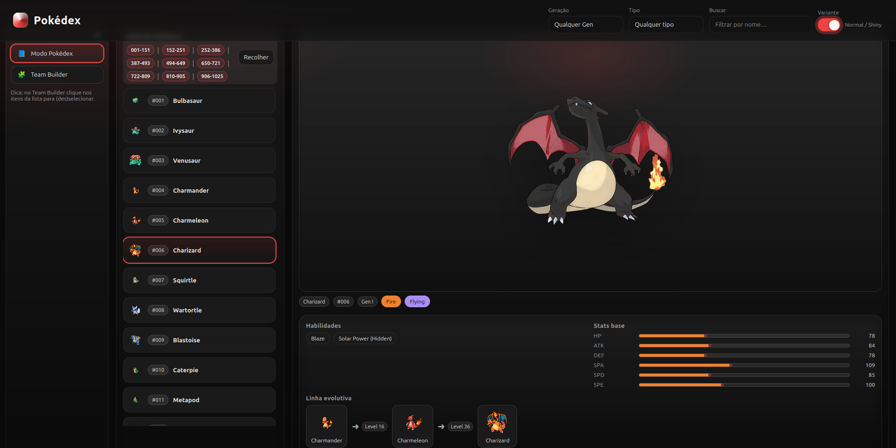

# Pokédex & Team Builder

Uma aplicação interativa baseada na **PokéAPI** que permite navegar por todos os 1025 Pokémon, visualizar detalhes, filtrar por geração/tipo, alternar entre variantes **Normal/Shiny**, e até montar seu próprio time com até 6 Pokémon.

Acesse em: https://viniaug7.github.io/vinidex.github.io/

